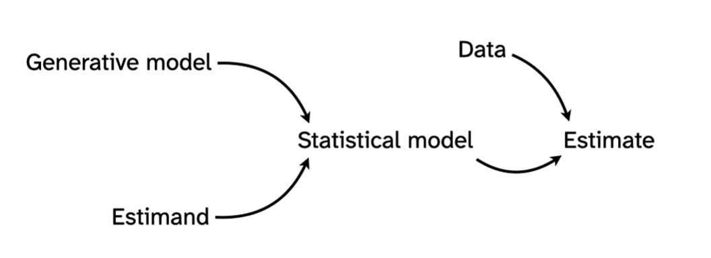

##Lecture A01 Notes

###Week: 6th Jan 2026

Source:

https://www.youtube.com/watch?v=ztbYkBPDOgU

- Scientific theory ::: science before statistics
- For statistical models to produce scientific insight, they depend ypon scientific/casual models
- Meaning of statistical analysis is not found in the data but rather in theories

### Core Bayseian Workflow

  ==> 
 ==> 

- Prior model checking: to check if the model is correct before its modeled , scientific sense
- Posterior model checking: to check after the model has been created . After the data has been "fitted"
- Parameter estimation:
  
           - marginal effects (statistical averaging)
           - casual error estimation
           - sensitivity analysis

- 

- Bayesian vs Frequentism :: Bayseian has prevailed
